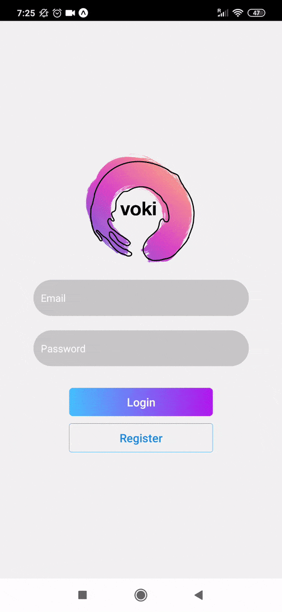
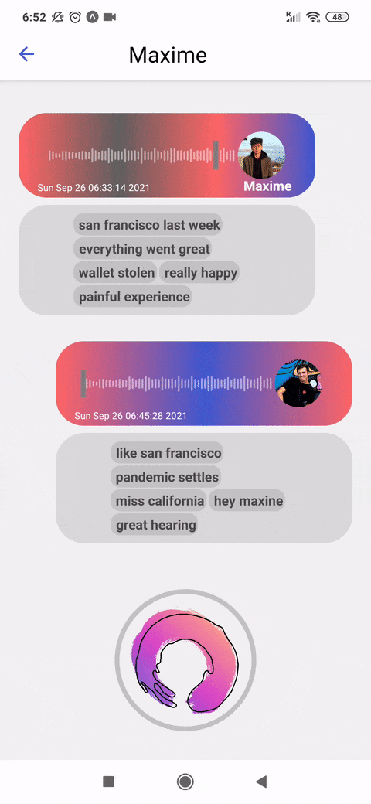

# voki - audio messaging reimagined

<p align="center">

</p>
	
voki is an audio messaging app that leverages the power of AI to put your communication bandwidth on steroids. Beautiful visualisation of messages based on sentiment, automatically generated transcript and tags.


<p align="center">
 |  |     
</p>

## Building the app 

### Dependencies:
- [React Native](https://github.com/facebook/react-native) 
- [Expo](https://github.com/expo/expo)

### Configuration
Add Firebase API configuration in [firebase.js](firebase.js):
```Javascript
const firebaseConfig = {
	apiKey: 'your-api-key',
	authDomain: 'your-auth-domain',
	projectId: 'your-project-id,
	storageBucket: 'your-storage-bucket',
	messagingSenderId: 'your-messaging-sender-id',
	appId: 'your-app-id',
	measurementId: 'your-measurement-id',
};
```

## Running

Use a terminal in the `root` dir of the repo.

### Front-end
```bash
npm install
expo start
```

### ML Backend

```shell
pip install /r requirements.txt
python main.py
ngrok http 4030
```

